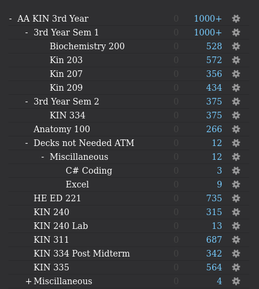
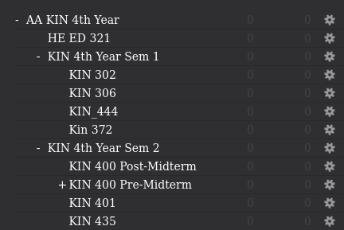

# All My Notes from my Kinesiology Degree - 3rd and 4th Year

These are all my notes from when I first started my Anki journey to now. I still use Anki daily for everything that I do. At this point, I don't even write notes anymore. In class, I just write questions and answers that I could format into Anki cards, transfer them into Anki later and then delete those other notes.

## Why I use Anki

Anki is a revolutionary data bank for everything that I would have forgotten. Before I used to have written notes on paper and online. However I would never look at them after my class was over.

Anki allows me to store all my data in a centralized area AS WELL AS automating the learning process with its built in spaced reptition.

**I even use Anki for daily things I learn in my day to day!**

__________________________________

## Add-Ons

These Add-ons are what I found after years of updating and researching to boost my productivity the most

**All of these can be obtained in the "Anki Addons" folder**

- Button Colours Good Again - https://ankiweb.net/shared/info/2494384865
- Cloze Overlapper - https://ankiweb.net/shared/info/109531687
- Color Confirmation - https://ankiweb.net/shared/info/1084228676
- Frozen Fields - https://ankiweb.net/shared/info/516643804
- Hierarchical Tags 2
- Image Occlusion Enhanced for Anki 21 Alpha
- Leaderboard
- No Distractions Full Screen Clean review interface
- Puppy Reinforcement
- Remaining time for Anki 21
- Review Heatmap
- Speed Focus Mode auto-alert auto-reveal auto-fail
- Spell Checker
- Syntax highlighting for Code
- True Retention
- Visual Feedback for Reviews
    __________________________________

## My Notes

Everything of my KIN degree is located in
- AA KIN 3rd Year
- AA KIN 4th Year

    **Everything else is separate packages that are a part of these decks.**

### AA KIN 3rd Year

- Biochemistry 200
- KIN 203 - Skill Acquisition and Performance
- KIN 207 - Physical Growth and Psychomotor Development
- KIN 209 - Research Methods in Kinesiology
- KIN 240 - Introduction to Sports Injury Management
- KIN 311 - Assessment of Fitness and Health
- KIN 334 - Physical Activity, Nutrition and Energy Balance
- KIN 335 - Advanced Conditioning Methodology

    

### AA KIN 4th Year

- KIN 302 - Human Motor Control
- KIN 306 - Quantitative Biomechanics of Human Movement
- KIN 444 - Communication Skills and Strategies in Sport and Physical Activity
- KIN 372 - Neuroscience Considerations for Adapted Physical Activity
- KIN 400 - Human Gross Anatomy
- KIN 401 - Applied Ethics in Sport, Physical Activity and Exercise
- KIN 435 - Applied Resistance Training

    

    __________________________________

### Extra Resources

An Anki Tutorial Video I Made: https://drive.google.com/file/d/1TUF_yPYD15All1eQtouR13cG5RDu0ivS/view?usp=sharing

An Anki Promotion Video I Made: (Not Sponsored): https://www.youtube.com/watch?v=gYBYyg3fGRQ

> To be Added:
> - Music (Harmonize Notes)
> - Spanish (Basic Vocabulary)
> - Computer Science (CSS, HTML, JS, Python, React, SASS, JQuert, Redux, Bash)
> - KIN 440 - Applied Injury Management

